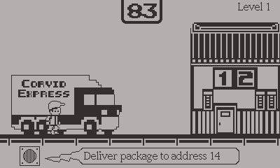

# pp-lib
[](https://toyboxpy.io)

The Playdate-Platformer Library is a comprehensive library that simplifies the process of creating platformer games for the Playdate. It includes all the necessary components to ensure smooth and satisfying jumping mechanics.

- [Install](#install)
- [QuickStart](#quick-start)
- [Examples](#examples)
- [Games made with PP-Lib](#Games-made-with-PP-Lib)
- [Api](#api)
  - [Actor](#Actor)
  - [Solid](#Solid)
  - [Trigger](#Trigger)
  - [FollowCamera](#FollowCamera)
  - [DefaultPlatformer](#DefaultPlatformer)
  - [BasePlatformer](#BasePlatformer)
  - [InputHandler](#InputHandler)
  - [Machine](#Machine)
  - [State](#State)
    - [BaseState](#basestate)
    - [GroundState](#Groundstate)
    - [AirState](#Airstate)
    - [IdleState](#Idlestate)
    - [RunState](#Runstate)
    - [JumpState](#Jumpstate)
    - [FallState](#FallState)
  - [AnimatedImage](#animatedimage)

# Install

### Toybox
You can add it to your Playdate project by installing toybox.py, going to your project folder in a Terminal window and typing:

```lua
toybox add pplib
toybox update
```
Then, if your code is in the source folder, just import the following:

```lua
import '../toyboxes/toyboxes.lua'
```

### Manual instal
To install the Playdate-Platformer Library, simply copy the pp-lib.lua file into your game directory and import it into your game.
```lua
import "pp-lib"
```

# Quick Start

```lua
import "CoreLibs/object"
import "CoreLibs/graphics"
import "CoreLibs/sprites"
import "pp-lib"

local pd <const> = playdate
local gfx <const> = pd.graphics

-- Player class
class("Player").extends(DefaultPlatformer)

local player_img = gfx.image.new(32, 32)
gfx.pushContext(player_img)
	gfx.fillRect(0, 0, 32, 32)
gfx.popContext(player_img)

function Player:init(x, y)
	Player.super.init(self, {idle=player_img, run=player_img, jump=player_img, fall=player_img})
	self:setCollideRect(0,0, player_img:getSize())
	self:moveTo(x, y)
end

-- Block class

class("Block").extends(Solid)
local block_img = gfx.image.new(16,16)
gfx.pushContext(block_img)
	gfx.fillRect(0, 0, 16, 16)
gfx.popContext(block_img)

function Block:init(x, y)
	Block.super.init(self)
	self:setImage(block_img)
	self:setCollideRect(0,0, block_img:getSize())
	self:moveTo(x, y)
end

-- set up game
Player(50, 50)

-- blocks
for i=1,12,1 do
	Block(8+(i-1)*16, 80)
end
for i=1,12,1 do
	Block(392-(i-1)*16, 160)
end

-- walls
Solid.addEmptyCollisionSprite(0, -10, 400, 10)
Solid.addEmptyCollisionSprite(0, 240, 400, 10)
Solid.addEmptyCollisionSprite(-10, 0, 10, 240)
Solid.addEmptyCollisionSprite(400, 0, 10, 240)

function playdate.update()
	gfx.sprite.update()
end

```

The above code demonstrates how to use the Playdate-Platformer Library to create a platformer game for the Playdate.
For a more detailed description of available parameters and functionalities, please refer to the API section below.

Below are the available parameters that you can customize for your platformer character:

```lua
self.has_air_control = true -- determins if player can be controlled while in the air
self.has_ground_control = true -- determins if player can be controlled while on the ground

self.run_speed_max = 200 -- maximum ground speed, in px/s
self.run_speed_acc = 20 -- acceleration speed when the player starts moving while on the ground, in px/s
self.run_speed_dcc = 40 -- deceleration speed when the player stops moving while on the ground

self.air_speed_max = 200 -- maximum horizontal air speed, in px/s
self.air_speed_acc = 20 -- horizontal acceleration speed when the player starts moving while on the air, in px/s
self.air_speed_dcc = 4 -- horizontal deceleration speed when the player stops moving while on the air, in px/s
self.jump_boost = 400 -- initial vertical speed when the player jumps, in px/s
self.jump_dcc = 20 -- the gravity applied while the player is jumping, in px/s
self.jump_max_time = 300 -- the maximum time the player can be accending, in ms
                         -- if, due to `jump_dcc`, the players vertical speed reaches 0
                         -- before this time, they will enter the fall state before this time
self.jump_min_time = 120 -- the minimum time the player can be accending, in ms
self.jump_count_max = 1 -- how many times the player can jump without touching the ground
self.jump_buffer_time = 300 -- how long should jump inputs be buffered, in ms
self.apex_boost = 10 -- a small vertical boost when the player goes from the `JumpState`
                     -- into the `FallState` to smooth out the arc, in px/s
self.bump_max = 6 -- the maxium distand the player can be bumped, in px
                  -- if the player hits the edge of a block while jumping, this allows them
                  -- to be pushed aside and continue the jump

self.fall_acc = 30 -- the gravity applied when the player is falling, in px/s
self.fall_hang_acc = 20 -- a reduced gravity applied at the apex of a jump to allow for more precision platforming, in px/s
self.fall_hang_time = 100 -- the time the reduced gravity is applied for, is ms
self.fall_max = 400 -- the maximum fall speed, in px/s
self.coyote_time = 120 -- the amount of time after the player walks off a platform where the jump button will still work, in ms
```

# Examples

- [Basic platformer](examples/1_basic_platformer/README.md)
- [Adding a pickup](examples/2_pickups/README.md)
- [Adding an enemy](examples/3_enemies/README.md)
- [Adding a new state](examples/4_adding_new_states/README.md)
- [Overriding default states](examples/5_overriding_states/README.md)
- [using LDtk](examples/6_using_ldtk/README.md)
- [Custom input handler - todo]()
- [Super Date Box - Large example](https://github.com/RobertCurry0216/super-date-box)

# Games made with PP-Lib

[Suddenly Bird](https://fevgames.itch.io/suddenly-bird)



# API

---

## Actor

extends `playdate.graphics.sprite`

a very thin wrapper around `playdate.graphics.sprite`, mostly because I prefer calling things 'actors' insted of 'sprites' 🤷

### `Actor:init()`

also calls `self:add()`

### `Actor:destroy()`

calls `self:remove()`

---

## Solid

extends [Actor](#Actor)

extend this class to create blocks/platforms that you want you player to be able to stand on.

### `Solid:init()`

sets its group to `{Group.solid}`

### `Solid:setSidePassthrough(side, passable)`

- `side`: `Side.top`, `Side.bottom`, `Side.left`, or `Side.right`. bitwise or can be used to set multiple sides at once `Side.left | Side.right`
- `passable`: boolean, if the player is able to passthrough coming from that direction.
  you may also set the mask directly, `solid.mask = Side.top`, this has the effect of setting all sides except that one being passable.

### `Solid.addEmptyCollisionSprite(x, y, w, h)`

utility function to add an invisible solid to the game

### `Solid.addWallSprites(tilemap, emptyTiles)`

utility function to make working with PlaydateLDtkImporter easier. Works very similar to `playdate.graphics.sprite.addWallSprites`.
Will return a list of the created sprites.

```lua
local passable = Solid.addWallSprites(tilemap, LDtk.get_empty_tileIDs(levelName, "Passthrough", layerName))
for _, s in ipairs(passable) do
  s.mask = Side.top
end
```

---

## Trigger

extends [Actor](#Actor)

a catch all class for everything that interacts with the player but doesn't stop them, eg: pickups, coins, spikes, enemies, etc.

### `Trigger:init()`

sets its group to `{Group.trigger}`

### `Trigger:perform(actor, col)`

to be overridden, is called when this object overlaps with the player

- `actor`: the player actor
- `col`: the [collision object](https://sdk.play.date/1.13.7/#m-graphics.sprite.moveWithCollisions)

---

## FollowCamera

an easy to use camera that will follow the platformer character around the level.

### `FollowCamera:init([mode, [config]])`
- `mode`: select how the camera will follow the player around. Either provide the mode using the `CameraMode` enum or a string value `"lock" | "hlock" | "box" | "look_ahead"`. Defaults to `"hlock"`
- `config`: optional config to customise the follow mode.

### `CameraMode`
an enum used when initalizing a `FollowCamera`
- `CameraMode.lock`
  - keeps the camera locked onto the player
  - config: all distances measured from the top left of the screen
    - `target_x_offset`: 200
    - `target_y_offset`: 120
    - `lerp`: 0.2
  - 

- `CameraMode.hlock`
  - keeps the horizontal position of the camera locked while allowing some more free movement in the vertical direction. Tends to be nicer for jumping as the camera jerks around less.
  - config: all distances measured from the top left of the screen
    - `target_x_offset`: 200
    - `top`: 100
    - `bottom`: 180
    - `lerp`: 0.2
  - 

- `CameraMode.box`
  - keeps the player within a set zone in the screen, allows more free movement in both the horizontal and vertical directions.
  - config: all distances measured from the top left of the screen
    - `top`: 100
    - `bottom`: 180
    - `left`: 150
    - `right`: 250
    - `lerp`: 0.2
  - 

- `CameraMode.look_ahead`
  - similar to `CameraMode.hlock` except it will shift the view to see further ahead of the direction the player is facing.
  - config: all distances measured from the top left of the screen
    - `look_distance`: 60
    - `top`: 100
    - `bottom`: 180
    - `lerp`: 0.1
  - 

### `FollowCamera:setTarget(target, ignore_snap)`

sets the target for the camera to follow. By default the camera will instantly snap to the target, you can ignore this behavior by passing true into `ignore_snap`

### `FollowCamera:clearTarget()`

removes the target. Remember to do this when removing the platformer from the game (dying for example) as `FollowCamera` keeps an internal ref to the target which may prevent it being cleaned up by the GC.

### `FollowCamera:update()`

updates the cameras position, call this in your game update function.

### `FollowCamera:setBounds(rect or sprite)`

sets the bounds to lock the camera to. If the bounds are set the camera cannot move past those bounds even if the target has moved out of those bounds.

### `FollowCamera:shake(amount, [time])`

Adds some nice juicy screen shake. Just call this once and the screen shake will decay over the provided time, if `time` is not provided `amount` will be used. `time` is in frames.

you can just provide a large `amount` to get a burst of screen shake:
```lua
cam:shake(10)
```


or provide a low `amount` with a high `time` to get a sustained rumble
```lua
cam:shake(3, 60)
```


---

## DefaultPlatformer

extends [BasePlatformer](#BasePlatformer)
A good starting place for most platformers, sets up sensible defaults for all values and sets up the state machine.
Sub class this class to create your platformer character.

### `DefaultPlatformer:init(images, options)`

- `images`:`{idle=[image or imagetable], run=[image or imagetable], jump=[image or imagetable], fall=[image or imagetable]}`. The images to be used for each of the different states, under the hood it uses [AnimatedImage](https://github.com/mierau/playdate-animatedimage).
- `options`:`{idle=[AnimatedImage options], run=[AnimatedImage options], jump=[AnimatedImage options], fall=[AnimatedImage options]}`
  - options for each of the different images, as per [AnimatedImage](https://github.com/mierau/playdate-animatedimage)
    - `delay`: time in milliseconds to wait before moving to next frame. (default: 100ms)
    - `paused`: start in a paused state. (default: false)
    - `loop`: loop the animation. (default: false)
    - `step`: number of frames to step. (default: 1)
    - `sequence`: an array of frame numbers in order to be used in the animation e.g. `{1, 1, 3, 5, 2}`. (default: all of the frames from the specified image table)

initalises the state machine like this:

```lua
self.sm:addState("idle", IdleState(self, images.idle, options.idle))
self.sm:addState("run", RunState(self, images.run, options.run))
self.sm:addState("jump", JumpState(self, images.jump, options.jump))
self.sm:addState("fall", FallState(self, images.fall, options.fall))

self.sm:addEvent({name='run', from='*', to='run'})
self.sm:addEvent({name='stop', from='run', to='idle'})
self.sm:addEvent({name='jump', from='*', to='jump'})
self.sm:addEvent({name='fall', from='*', to='fall'})
self.sm:addEvent({name='land', from='fall', to=defaultLandEvent})

self.sm:addCallback('onland', defaultOnLandCallback)
self.sm:addCallback('onbeforefall', defaultOnBeforeFallCallback)
self.sm:addCallback('onbeforejump', defaultOnBeforeJumpCallback)
```

### `DefaultPlatformer.buttons`

buttons is a table containing the key to be used to control the player

- `left`: button to move left
  - default `playdate.kButtonLeft`
- `right`: button to move right
  - default `playdate.kButtonRight`
- `jump`: button to jump
  - default `playdate.kButtonA`

### `DefaultPlatformer` properties

Heres all the different properties that can be tweaked to make your platformer

```lua

self.has_air_control = true -- determins if player can be controlled while in the air
self.has_ground_control = true -- determins if player can be controlled while on the ground

self.run_speed_max = 200 -- maximum ground speed, in px/s
self.run_speed_acc = 20 -- acceleration speed when the player starts moving while on the ground, in px/s
self.run_speed_dcc = 40 -- deceleration speed when the player stops moving while on the ground

self.air_speed_max = 200 -- maximum horizontal air speed, in px/s
self.air_speed_acc = 20 -- horizontal acceleration speed when the player starts moving while on the air, in px/s
self.air_speed_dcc = 4 -- horizontal deceleration speed when the player stops moving while on the air, in px/s
self.jump_boost = 400 -- initial vertical speed when the player jumps, in px/s
self.jump_dcc = 20 -- the gravity applied while the player is jumping, in px/s
self.jump_max_time = 300 -- the maximum time the player can be accending, in ms
                         -- if, due to `jump_dcc`, the players vertical speed reaches 0 before this time, they will enter the fall state before this time
self.jump_min_time = 120 -- the minimum time the player can be accending, in ms
self.jump_count_max = 1 -- how many times the player can jump without touching the ground
self.jump_buffer_time = 300 -- how long should jump inputs be buffered, in ms
self.apex_boost = 10 -- a small vertical boost when the player goes from the `JumpState` into the `FallState` to smooth out the arc, in px/s
self.bump_max = 6 -- the maxium distand the player can be bumped, in px
                  -- if the player hits the edge of a block while jumping, this allows them to be pushed aside and continue the jump

self.fall_acc = 30 -- the gravity applied when the player is falling, in px/s
self.fall_hang_acc = 20 -- a reduced gravity applied at the apex of a jump to allow for more precision platforming, in px/s
self.fall_hang_time = 100 -- the time the reduced gravity is applied for, is ms
self.fall_max = 400 -- the maximum fall speed, in px/s
self.coyote_time = 120 -- the amount of time after the player walks off a platform where the jump button will still work, in ms

```

---

## BasePlatformer

extends [Actor](#Actor)

A bare bone starting point for a platformer. Initalises the statemachine but does not add any states or events.
Does not initalise any parameters.
Sub class this class to create your platformer character.

### `BasePlatformer.sm`

the players state machine

### `BasePlatformer.inputs`

the players input handler

### `BasePlatformer:init()`

Initalises the statemachine but does not add any states or events.
Does not initalise any parameters.
Adds the player to the `{Group.actor}` group, and sets collidesWithGroups to `{Group.solid, Group.trigger}`

### `BasePlatformer:update()`

performs the following thins in order:

1. calls `update` on the input handler
2. calls `update` on the current state
3. calls `move` on self
4. calls `updateImageFlip` on self

### `BasePlatformer:collisionResponse()`

returns `kCollisionTypeSlide` if othe is fully solid, otherwise returns `kCollisionTypeOverlap`

### `BasePlatformer:move()`

performs the following thins in order:

1. moves the player with collisions
2. calls `resolveCollision` on all `Solid`s collided with
3. calls `perform` on all `Trigger`s collided with
4. calls `aftermove` on the current state
5. calls `aftermove` on self

### `BasePlatformer:aftermove(cols, l, tx, ty)`

- `cols`: [collision objects](https://sdk.play.date/1.13.7/#m-graphics.sprite.moveWithCollisions)
- `l`: number of collisions
- `tx`: target x
- `ty`: target y

called after all movement resolutions are done
override if you want to do something here

---

## InputHandler

all input management is handled her to create a seperation of concerns and to make changing the controll scheme easy

### `InputHandler:update(buttons, actor)`

must set the following parametes

- `dx`: the horozontal direction, a number between -1 and 1 (usually -1, 0, or 1)
- `jump`: boolean, jump button held down
- `jump_pressed`: boolean, jump button just pressed
- `jump_buffered`: boolean, jump button pressed with in the last n ms (the `jump_buffer_time` set on the actor)

---

## Machine

the state machine based on [this one](https://github.com/kyleconroy/lua-state-machine) without the async transitions and some extra utility added.

### `Machine:addState(name, state)`

adds a state to the state machine, if it is the first state added, will also set it as the initial state

### `Machine:addEvent(event)`

event is a table with the values:

- `name`: the name of the event, a method will be added to the state maching allowing you to trigger this event. Additional arguments will be passed to the `onenter` method of the state. eg: `sm:run()`
- `from`: either a string or a list of strings, the states this event can be triggered from. If this event is triggered while the current state isn't part of this list, nothing happens. `'*'` may be used to allow the event from all states.
- `to`: either a string, the name of the state to enter, or a function that returns the name of the state to enter. The function is passed the args `{[Machine], [event name], [from]}`

### `Machine:addCallback([name], [callback])`

adds a callback function to be on or before a given event

- `name`: either `'on'..[event name]`, `'onbefore'..[event name]`, or `'onstatechange'`
- `callback`: function to be called, args passed `{ [Machine], name, from, to, ...}`

### `Machine:current()`

returns the current state object

### `Machine:get([name])`

returns the state object of that name

---

## State

the empty state class

---

## BaseState

extends [State](#State)

extend from this class to create new states for your platformer. Handles updating the spite image.

### `BaseState:init(actor, images, options)`

- `actor`: a [BasePlatformer](#BasePlatformer)
- `images`: either a image or an imagetable
- `options`: [AnimatedImage](#AnimatedImage) options

### `BaseState:onenter(sm, name, from, to)`

- `sm`: the state [Machine](#machine)
- `name`: the event name string
- `from`: the class name string of the state coming from
- `to`: the class name string of the state going to

### `BaseState:aftermove(cols, l, tx, ty)`

- `cols`: [collision objects](https://sdk.play.date/1.13.7/#m-graphics.sprite.moveWithCollisions)
- `l`: number of collisions
- `tx`: target x
- `ty`: target y

### `BaseState:update()`

called every frame when this is the current state

---

## GroundState

extends [BaseState](#BaseState)

handles jumping and checking if the player should fall

---

## AirState

extends [BaseState](#BaseState)

handles horizontal movement while in the air

---

## IdleState

extends [GroundState](#GroundState)

handles deceleration when the player stops, otherwise just sits there

---

## RunState

extends [GroundState](#GroundState)

handles horozontal movement while on the ground

---

## JumpState

extends [AirState](#AirState)

handles the vertical movement while in the accending portion of a jump, also handles the edge bumping behaviour

---

## FallState

extends [AirState](#AirState)

handles the vertical movement while in the decending portion of a jump, also handles the coyote time when running of a solid

---

## AnimatedImage

this library uses a slightly modified version of [AnimatedImage](https://github.com/mierau/playdate-animatedimage)
